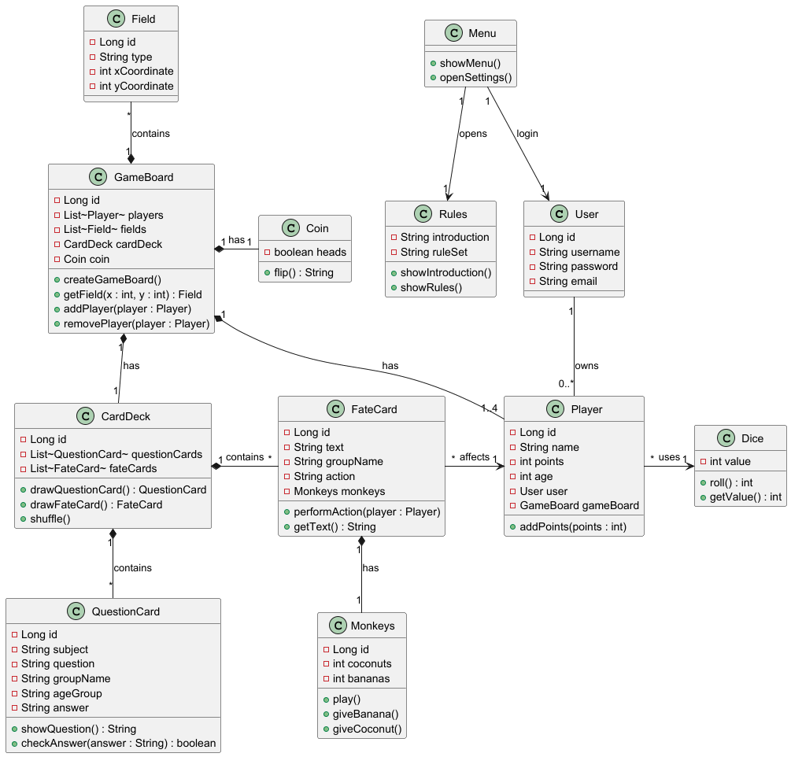

## Uge 3:

I denne uge redigerede jeg ydeligere på mit klasse diagram.
og begyndte at få lavet nogle flere af java klasserne med lombok og jpa.

Da US ikke har været helt klar har jeg ikke fået lavet meget kode endnu. Men har lavet en metode til terningen da den var basic.
samt er coin også lavet med en enkelt metode.

## US story i den rækkefølge de vil blive håndteret efter:

### US1 – Vælg antal spillere
Som game-master vil jeg kunne vælge antallet af spillere, så jeg kan oprette spillet med det ønskede antal deltagere.

#### Acceptkriterier:
•	På startskærmen kan game-master åbne spillerindstillinger.
 
•	Game-master kan angive antallet af spillere.
 
•	Systemet validerer, at antallet af spillere er inden for det tilladte antal.
 
•	Spillet kan først startes, når et gyldigt antal spillere er valgt.

### US9 – Angiv spillerens niveau/alder
Som game-master vil jeg kunne angive hver spillers alder eller faglige niveau, så spillet kan tilpasses den enkelte spiller.

#### Acceptkriterier:
•	Game-master kan angive alder eller niveau for hver spiller.
 
•	Oplysningerne gemmes sammen med spilleren.
 
•	Niveauet bruges til at tilpasse relevante spørgsmål/kort.

### US2 – Vælg emne/bane
Som game-master vil jeg kunne vælge et emne eller en bane, så spillet kan tilpasses det ønskede faglige område.

#### Acceptkriterier:
•	Game-master kan vælge "Vælg bane/emne" fra startmenuen.
 
•	Systemet viser de tilgængelige emner/baner.
 
•	Game-master kan vælge ét emne/bane.
 
•	Det valgte emne anvendes i det efterfølgende spil.

### US7 – Se spillebrikker
Som spiller vil jeg kunne se min egen og de andre spilleres placeringer på spillepladen, så jeg kan følge spillets udvikling.

#### Acceptkriterier:
•	Hele den relevante spilleplade vises.
 
•	Alle aktive spilleres brikker vises.
 
•	Det er muligt at identificere, hvilken brik der tilhører hvilken spiller.
 
•	Brikkernes placering opdateres efter en spillers tur.

### US4 – Udfør sin tur
Som spiller vil jeg kunne se, når det er min tur, og hvilke handlinger jeg kan foretage, så jeg ved, hvad jeg skal gøre.

#### Acceptkriterier:
•	Den aktive spiller fremhæves tydeligt.
 
•	Spilleren kan se sine tilgængelige handlinger.
 
•	Terning/spinner eller andre relevante spilleelementer kan aktiveres, når det er spillerens tur.
 
•	Andre spillere kan se, hvem der har tur.

###  US12 – Kast terning
Som spiller vil jeg kunne aktivere en terning, så systemet kan generere et tilfældigt antal øjne.

#### Acceptkriterier:
•	Spilleren kan aktivere terningen, når den er relevant.
 
•	Terningen viser en animation.
 
•	Systemet genererer et tilfældigt resultat.
 
•	Resultatet vises tydeligt.

### US14 – Flyt spillerbrik
Som spiller vil jeg kunne se min brik flytte sig efter mit terning-/spinnerresultat, så jeg tydeligt kan se resultatet af min tur.

#### Acceptkriterier:
•	Spillerens resultat bestemmer, om og hvor langt brikken flyttes.
 
•	Brikken animeres eller flyttes synligt på spillepladen.
 
•	Spillerens point/status opdateres efter bevægelsen.
 
•	Hvis spilleren mister sin tur, bliver brikken stående.
 
•	Systemet viser tydeligt, hvis spilleren mister sin tur.

### US15 – Vælg retning
Som spiller vil jeg kunne vælge retning, når spillepladen deler sig i flere mulige veje, så jeg selv kan bestemme, hvilken vej min brik skal bevæge sig.

#### Acceptkriterier:
•	Systemet viser de mulige retninger.
 
•	Spilleren kan vælge mellem de tilgængelige retninger.
 
•	Den valgte retning fremhæves.
 
•	Spilleren kan bekræfte sit valg.
 
•	Brikken fortsætter derefter i den valgte retning.

### US8 – Træk tilfældigt kort
Som spiller vil jeg automatisk få tildelt et tilfældigt kort, når jeg lander på et felt, der udløser et kort, så spillet kan fortsætte med en tilfældig udfordring eller handling.

#### Acceptkriterier:
•	Systemet registrerer, når en spiller lander på et kortfelt.
 
•	Systemet vælger et tilfældigt kort fra den relevante kortbunke.
 
•	Det valgte kort vises for spilleren.
 
•	Korttypen afhænger af feltet og spillets indstillinger.

### US5 – Se spørgsmål-/chancekort
Som spiller vil jeg kunne se det kort, jeg har trukket, så jeg kan læse og forstå spørgsmålet eller handlingen.

#### Acceptkriterier:
•	Når spilleren lander på et relevant felt, vises kortet.
 
•	Kortet vises tydeligt på skærmen.
 
•	Kortet indeholder det relevante spørgsmål eller den relevante handling.

### US6 – Besvare kort
Som spiller vil jeg kunne besvare et spørgsmålskort, så mit svar kan registreres i spillet.

#### Acceptkriterier:
•	Spilleren kan vælge eller indtaste et svar.
 
•	Spilleren kan trykke på en "Besvar"-knap.
 
•	Systemet registrerer spillerens svar.
 
•	Systemet kan afgøre, om svaret er korrekt, hvis spillet kræver det.

### US18 – Tilpas kort efter niveau
Som spiller vil jeg få spørgsmålskort, der passer til mit valgte niveau eller min alder, så spillets faglige udfordringer passer til mig.

#### Acceptkriterier:
•	Spillerens alder/niveau er registreret.
 
•	Når spilleren lander på et kortfelt, identificerer systemet spillerens niveau.
 
•	Systemet vælger kun relevante kort eller tilpasser sværhedsgraden.
 
•	Det valgte kort vises derefter for spilleren.

### US11 – Kast mønt
Som spiller vil jeg kunne aktivere en mønt, så systemet tilfældigt kan vælge mellem møntens to udfald.

#### Acceptkriterier:
•	Spilleren kan aktivere mønten.
 
•	Mønten animeres som om den bliver kastet.
 
•	Systemet genererer tilfældigt et udfald.
 
•	Udfaldet vises tydeligt for spilleren.

### US13 – Stem på startspiller
Som spiller vil jeg kunne stemme på, hvilken spiller jeg tror starter spillet, så jeg kan deltage i spillets startmekanisme.

#### Acceptkriterier:
•	Funktionen er tilgængelig i "Take a Chance".
 
•	Alle spillere kan afgive én stemme.
 
•	Spillerne slår med terningen for at afgøre, hvem der faktisk starter.
 
•	Ved samme antal øjne starter den yngste spiller.
 
•	Spillere, der har gættet korrekt, får den beskrevne fordel ved start.

### US16 – Se skæbneskjold
Som spiller vil jeg kunne se, når jeg har et skæbneskjold, så jeg ved, at jeg har en beskyttelse til rådighed.

#### Acceptkriterier:
•	Når spilleren modtager et skæbneskjold, vises et ikon.
 
•	Ikonet vises ved spillerens navn.
 
•	Ikonet forbliver synligt, indtil skjoldet bliver brugt.

### US17 – Anvend skæbneskjold
Som spiller vil jeg automatisk være beskyttet af mit skæbneskjold, når jeg udsættes for en negativ hændelse, så jeg ikke mister de point eller effekter, som hændelsen ellers ville påvirke.

#### Acceptkriterier:
•	Systemet registrerer, om spilleren har et aktivt skæbneskjold.
 
•	Skjoldet aktiveres automatisk ved en relevant negativ hændelse.
 
•	Spilleren påvirkes ikke af hændelsen.
 
•	Skæbneskjoldet fjernes efter brug.
 
•	De øvrige spillere påvirkes efter spillets regler.

### US10 – Se faglig feedback
Som spiller vil jeg efter spillets afslutning kunne se feedback på min faglige præstation, så jeg kan se, hvilke emner jeg har styr på, og hvilke jeg bør træne mere.

#### Acceptkriterier:
•	Der vises en resultatside, når spillet afsluttes.
 
•	Spilleren kan se sin samlede præstation.
 
•	Resultatet viser relevante faglige områder.
 
•	Systemet angiver eventuelt områder, hvor spilleren bør træne mere.

### US3 – Gem spil
Som game-master vil jeg kunne gemme et aktivt spil, så spillet kan fortsættes på et senere tidspunkt.

#### Acceptkriterier:
•	Game-master kan logge ind under et aktivt spil.
 
•	Spillets aktuelle status gemmes.
 
•	Spillernes placeringer, point og relevante spilstatusser gemmes.
 
•	Et gemt spil kan indlæses igen.

